# 📊 ERD Diagram - Kodomo Weekend Navi Database

## Sơ đồ quan hệ cơ sở dữ liệu

```mermaid
erDiagram
    USERS ||--o{ CHILDREN : "có"
    USERS ||--o{ REVIEWS : "viết"
    USERS ||--o{ FAVORITES : "lưu"
    USERS ||--o{ SCHEDULES : "lên lịch"
    USERS ||--o{ KIDSWIPE_HISTORY : "swipe"
    USERS ||--o{ RECOMMENDATIONS : "nhận gợi ý"
    USERS ||--o{ ADMIN_ACTIVITY_LOGS : "thực hiện"
    
    CHILDREN ||--o{ CHILD_PREFERENCES : "có sở thích"
    CHILDREN ||--o{ KIDSWIPE_HISTORY : "swipe"
    CHILDREN ||--o{ RECOMMENDATIONS : "dành cho"
    
    SPOTS ||--o{ SPOT_IMAGES : "có ảnh"
    SPOTS ||--o{ SPOT_FACILITIES : "có tiện nghi"
    SPOTS ||--o{ SPOT_TAGS : "có tag"
    SPOTS ||--o{ REVIEWS : "được đánh giá"
    SPOTS ||--o{ FAVORITES : "được yêu thích"
    SPOTS ||--o{ SCHEDULES : "trong lịch"
    SPOTS ||--o{ KIDSWIPE_HISTORY : "được swipe"
    SPOTS ||--o{ RECOMMENDATIONS : "được đề xuất"
    
    REVIEWS ||--o{ REVIEW_IMAGES : "có ảnh"
    REVIEWS ||--o{ REVIEW_FACILITIES : "đánh giá tiện nghi"

    USERS {
        int user_id PK
        varchar email UK
        varchar password_hash
        varchar first_name
        varchar last_name
        enum role
        enum status
        decimal location_lat
        decimal location_lng
        varchar location_name
        boolean agreement
        timestamp created_at
        timestamp last_login_at
    }

    CHILDREN {
        int child_id PK
        int user_id FK
        varchar name
        date birth_date
        int age "computed"
        varchar avatar_url
        text notes
        timestamp created_at
    }

    CHILD_PREFERENCES {
        int preference_id PK
        int child_id FK
        enum preference_type
        varchar tag_name
        timestamp created_at
    }

    SPOTS {
        int spot_id PK
        varchar name
        text description
        enum category
        int min_age
        int max_age
        enum price_range
        boolean is_indoor
        varchar address
        decimal latitude
        decimal longitude
        varchar google_maps_url
        json operating_hours
        boolean is_open_today
        enum weather_suitable
        int estimated_visit_duration
        decimal average_rating
        int total_reviews
        enum status
        int created_by_admin_id FK
        timestamp created_at
    }

    SPOT_IMAGES {
        int image_id PK
        int spot_id FK
        varchar image_url
        boolean is_main
        int display_order
        timestamp uploaded_at
    }

    SPOT_FACILITIES {
        int facility_id PK
        int spot_id FK
        varchar facility_name
        boolean is_available
        text notes
    }

    SPOT_TAGS {
        int tag_id PK
        int spot_id FK
        varchar tag_name
    }

    REVIEWS {
        int review_id PK
        int spot_id FK
        int user_id FK
        int rating
        varchar comment
        int safety_report_count
        int helpful_count
        boolean is_hidden
        timestamp posted_at
    }

    REVIEW_IMAGES {
        int review_image_id PK
        int review_id FK
        varchar image_url
        timestamp uploaded_at
    }

    REVIEW_FACILITIES {
        int review_facility_id PK
        int review_id FK
        varchar facility_name
        boolean is_checked
    }

    FAVORITES {
        int favorite_id PK
        int user_id FK
        int spot_id FK
        varchar collection_tag
        timestamp saved_at
    }

    SCHEDULES {
        int schedule_id PK
        int user_id FK
        int spot_id FK
        date scheduled_date
        enum time_slot
        int travel_time
        boolean reminder_enabled
        enum status
        text notes
        timestamp created_at
    }

    KIDSWIPE_HISTORY {
        int swipe_id PK
        int user_id FK
        int child_id FK
        int spot_id FK
        enum action
        timestamp timestamp
    }

    RECOMMENDATIONS {
        int recommendation_id PK
        int user_id FK
        int child_id FK
        int spot_id FK
        decimal score
        json factors
        timestamp generated_at
        timestamp expires_at
    }

    KPIS_METRICS {
        int metric_id PK
        date date
        varchar metric_name
        decimal value
        enum time_period
        timestamp calculated_at
    }

    ADMIN_ACTIVITY_LOGS {
        int log_id PK
        int admin_id FK
        enum action
        varchar target_type
        int target_id
        json details
        timestamp timestamp
    }

    WEATHER_CONDITIONS {
        int weather_id PK
        date date
        varchar location
        enum condition
        decimal temperature
        timestamp fetched_at
    }
```

## 📋 Giải thích các mối quan hệ chính

### 1️⃣ Users (Người dùng)
- **One-to-Many** với Children: Một user có nhiều hồ sơ trẻ
- **One-to-Many** với Reviews: Một user viết nhiều đánh giá
- **One-to-Many** với Favorites: Một user lưu nhiều địa điểm yêu thích
- **One-to-Many** với Schedules: Một user có nhiều lịch trình
- **One-to-Many** với KidSwipe_History: Một user có nhiều lượt swipe

### 2️⃣ Spots (Địa điểm)
- **One-to-Many** với Spot_Images: Một địa điểm có nhiều ảnh
- **One-to-Many** với Spot_Facilities: Một địa điểm có nhiều tiện nghi
- **One-to-Many** với Spot_Tags: Một địa điểm có nhiều tag
- **One-to-Many** với Reviews: Một địa điểm có nhiều đánh giá

### 3️⃣ Children (Hồ sơ trẻ)
- **One-to-Many** với Child_Preferences: Một trẻ có nhiều sở thích/không thích
- **One-to-Many** với KidSwipe_History: Lịch sử các lần swipe của trẻ

### 4️⃣ Reviews (Đánh giá)
- **One-to-Many** với Review_Images: Một review có nhiều ảnh
- **One-to-Many** với Review_Facilities: Một review đánh giá nhiều tiện nghi

## 🔑 Các Index quan trọng

### Performance Indexes:
- `idx_email` - Tìm kiếm user nhanh
- `idx_location` - Query địa điểm theo tọa độ
- `idx_rating` - Sắp xếp theo rating
- `ft_name_description` - Full-text search địa điểm

### Foreign Key Indexes:
- Tất cả foreign keys đều có index để tối ưu JOIN queries

## 🔄 Triggers tự động

### Automatic Rating Updates:
- `update_spot_rating_after_insert` - Cập nhật rating khi có review mới
- `update_spot_rating_after_update` - Cập nhật rating khi chỉnh sửa review
- `update_spot_rating_after_delete` - Cập nhật rating khi xóa review

## 📊 Views có sẵn

1. **view_top_rated_spots** - Top địa điểm đánh giá cao nhất
2. **view_popular_spots** - Địa điểm được yêu thích nhiều nhất

## 🎯 Các đặc điểm nổi bật

### 1. Computed Column:
- `age` trong table `children` - Tự động tính tuổi từ birth_date

### 2. JSON Fields:
- `operating_hours` - Giờ mở cửa linh hoạt
- `factors` - Lý do recommendation
- `details` - Chi tiết admin logs

### 3. ENUMs:
- Đảm bảo data integrity
- Dễ maintain và query

### 4. Cascading Deletes:
- Xóa user → tự động xóa children, reviews, favorites, etc.
- Xóa spot → tự động xóa images, facilities, tags, etc.

## 📈 Tổng kết

- **Tổng số bảng**: 17 tables
- **Tổng số views**: 2 views  
- **Tổng số triggers**: 3 triggers
- **Tổng số indexes**: 30+ indexes
- **Support**: Full UTF-8 (emoji, tiếng Nhật, tiếng Việt)
